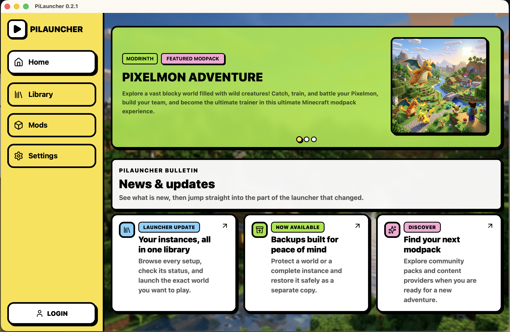
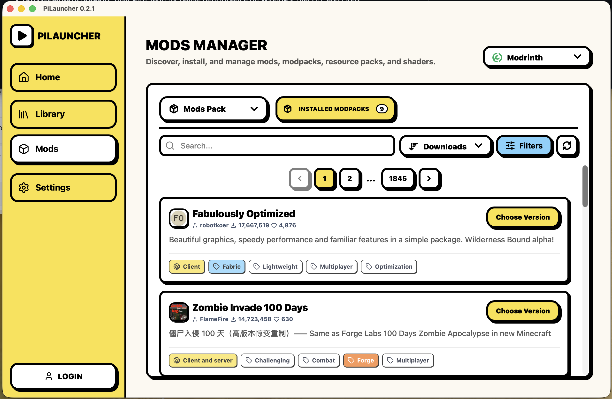
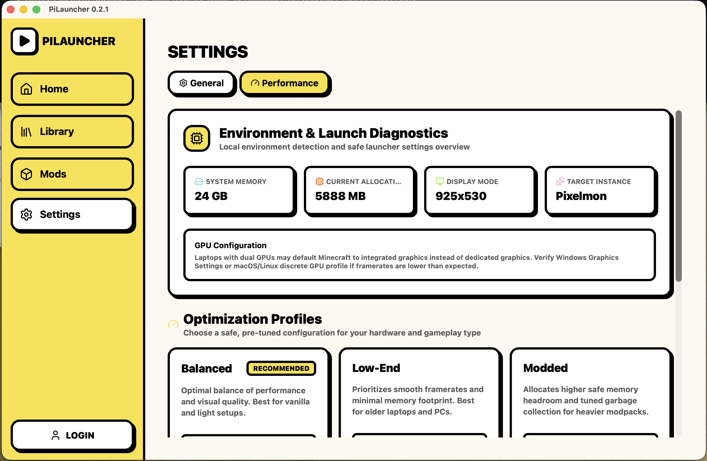

  
  <h1>PiLauncher</h1>

PiLauncher is a modern, premium, and cross-platform Minecraft launcher built with Tauri, React, Typescript, and a robust Rust backend. It features a stunning Soft Neobrutalism design system and provides a rich feature set for seamlessly managing your Minecraft experience.

## Screenshots

  <table>
    <tr>
      <td align="center"><b>Home View</b></td>
      <td align="center"><b>Mods View</b></td>
      <td align="center"><b>Settings View</b></td>
    </tr>
    <tr>
      <td width="33%"></td>
      <td width="33%"></td>
      <td width="33%"></td>
    </tr>
  </table>

## Features

- **Cross-Platform Native Experience**: Built with Tauri 2 for high performance and minimal resource overhead across Windows, macOS, and Linux.
- **Account & Identity**:
  - Secure Microsoft OAuth 2.0 authentication with automatic token refresh.
  - Offline authentication mode for local sessions.
  - Multi-account management with instant account switching.
  - **Skin Manager**: Interactive skin preview and appearance management for your Minecraft characters.
- **Instance & Game Management**:
  - Full Minecraft Java Edition runtime environment with automatic Java detection.
  - High-performance, concurrent asset and library downloader backend written in Rust.
  - Support for vanilla and popular mod loaders: **Fabric**, **Forge**, **NeoForge**, and **Quilt**.
  - **Global Options Sync**: Synchronize keybindings, audio, video, and accessibility settings between instances with backup restoration.
  - Real-time game logs, console monitoring, and crash diagnostics.
- **Mods & Modpacks**:
  - Browse, search, and install mods, modpacks, and resource packs from **Modrinth** and **CurseForge**.
  - Create and manage custom modpacks with version and loader selectors.
  - Automatic dependency checking and version compatibility indicators.
- **Multiplayer & Server Browser**:
  - Browse verified community servers or manage personal saved servers.
  - Live server pinging (online status, player count, ping latency, and colored MOTD rendering).
  - Quick launch with automatic server connection.
- **In-App Feedback & Issue Reporting**:
  - Built-in bug report and feature proposal system directly within the launcher.
  - Safe system diagnostic collection (OS, app version, Java runtime) with privacy controls.
  - One-click pre-filled GitHub Issue creation and Markdown clipboard export.
  - Quick crash reporting integration from crash dialogs.
- **Customization & Design**:
  - Signature Soft Neobrutalism design system with lively animations and high-contrast typography.
  - Flexible JVM arguments, memory allocation sliders, and resolution settings.
- **Internationalization (i18n)**:
  - Comprehensive localization supporting 8 languages: English, Vietnamese (Tiếng Việt), German (Deutsch), Filipino, Portuguese - Brazil (Português), Russian (Русский), Thai (ไทย), and Simplified Chinese (简体中文).
